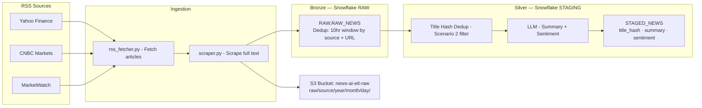

# news-ai-etl

An AI-powered ELT pipeline that fetches financial news from RSS feeds, scrapes full article text, deduplicates across sources, and uses an LLM to generate summaries and sentiment analysis — all stored in Snowflake.

---

## Architecture



---

## Project Structure

```
news-ai-etl/
├── ingestion/
│   ├── config.py           # RSS feed URLs
│   ├── rss_fetcher.py      # Fetch and parse RSS feeds
│   └── scraper.py          # Scrape full article text from URLs
├── storage/
│   ├── s3_storage.py       # Save raw JSON to S3 (date-partitioned)
│   ├── snowflake_loader.py # Load raw articles into Snowflake bronze
│   └── silver_loader.py    # Dedup by title hash, load into silver
├── snowflake_queries/
│   ├── setup.sql           # Bronze layer DDL (RAW schema + RAW_NEWS table)
│   └── staging_setup.sql   # Silver layer DDL (STAGING schema + STAGED_NEWS table)
├── docs/
│   └── architecture.md     # Full architecture diagram
├── run.py                  # Main pipeline entry point
├── requirements.txt
└── .env                    # Local credentials (never committed)
```

---

## Data Flow

| Step | What happens |
|------|-------------|
| 1 — Fetch | Poll 3 RSS feeds, parse each article (title, link, published, description) |
| 2 — Scrape | Visit each article URL, extract full body text using BeautifulSoup |
| 3 — S3 | Save raw JSON to `s3://news-ai-etl-raw/raw/{source}/year=/month=/day=/` |
| 4 — Bronze | Insert into `RAW.RAW_NEWS` — skip if same source+URL seen in last 10 hrs |
| 5 — Silver | Deduplicate by title hash (same story across feeds), run LLM, save to `STAGING.STAGED_NEWS` |

---

## Deduplication Strategy

**Scenario 1 — Same article, same feed (repeat fetch)**
- Checked at bronze insert time
- Query `RAW.RAW_NEWS` for matching `source + link` within the last 10 hours
- If exists → skip insert

**Scenario 2 — Same story, different feed**
- Checked at silver insert time
- Normalize title → lowercase + strip → MD5 hash
- If hash already in `STAGED_NEWS` → skip LLM + insert

---

## Snowflake Schema

**Bronze — `RAW.RAW_NEWS`**

| Column | Type | Description |
|--------|------|-------------|
| source | VARCHAR | Feed name (yahoo_finance, cnbc_markets, marketwatch) |
| title | VARCHAR | Article headline |
| link | VARCHAR | Article URL |
| published | VARCHAR | Published date from RSS |
| description | TEXT | Opening lines from RSS feed |
| text | TEXT | Full scraped article body |
| fetched_at | VARCHAR | Timestamp when fetched |

**Silver — `STAGING.STAGED_NEWS`**

| Column | Type | Description |
|--------|------|-------------|
| title_hash | VARCHAR | MD5 of normalized title (dedup key) |
| source | VARCHAR | First source that had this story |
| title | VARCHAR | Article headline |
| link | VARCHAR | Article URL |
| published | VARCHAR | Published date |
| description | TEXT | Opening lines |
| text | TEXT | Full article body |
| fetched_at | VARCHAR | When fetched |
| staged_at | VARCHAR | When moved to silver |

---

## Setup

**1 — Clone and create virtual environment**
```bash
git clone https://github.com/ayanhussain81/news-ai-etl.git
cd news-ai-etl
python -m venv venv
venv\Scripts\activate
pip install -r requirements.txt
```

**2 — Create `.env` file**
```
SNOWFLAKE_PASSWORD=your_password_here
```

**3 — Set up Snowflake**

Run in Snowsight (in order):
```
snowflake_queries/setup.sql
snowflake_queries/staging_setup.sql
```

**4 — Run the pipeline**
```bash
python run.py
```

---

## Branches

| Branch | Purpose |
|--------|---------|
| `feature/local-ingestion` | RSS fetch + scraper + S3 + Snowflake bronze |
| `feature/dedup` | + 10hr bronze dedup + title hash silver dedup |
| `feature/airflow-dags` | Airflow DAG conversion (coming soon) |

---

## Tech Stack

- **Python** — ingestion, scraping, orchestration
- **feedparser** — RSS parsing
- **BeautifulSoup** — article text scraping
- **boto3** — S3 upload
- **snowflake-connector-python** — Snowflake integration
- **AWS S3** — raw data lake storage
- **Snowflake** — bronze + silver data warehouse
- **LLM** — summary and sentiment analysis (coming soon)
