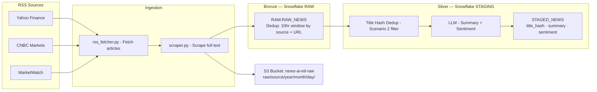

# News AI ETL — Architecture Diagram

```mermaid
flowchart LR

    subgraph SRC["RSS Sources"]
        direction TB
        Y["Yahoo Finance"]
        C["CNBC Markets"]
        MW["MarketWatch"]
    end

    subgraph ING["Ingestion"]
        direction TB
        F["rss_fetcher.py - Fetch articles"]
        SC["scraper.py - Scrape full text"]
    end

    S3["S3 Bucket: news-ai-etl-raw\nraw/source/year/month/day/"]

    subgraph BRONZE["Bronze — Snowflake RAW"]
        B["RAW.RAW_NEWS\nDedup: 10hr window by source + URL"]
    end

    subgraph SILVER["Silver — Snowflake STAGING"]
        direction TB
        D["Title Hash Dedup - Scenario 2 filter"]
        LLM["LLM - Summary + Sentiment"]
        SN["STAGED_NEWS\ntitle_hash · summary · sentiment"]
    end

    Y --> F
    C --> F
    MW --> F
    F --> SC
    SC --> S3
    SC --> B
    B --> D
    D --> LLM
    LLM --> SN
```
